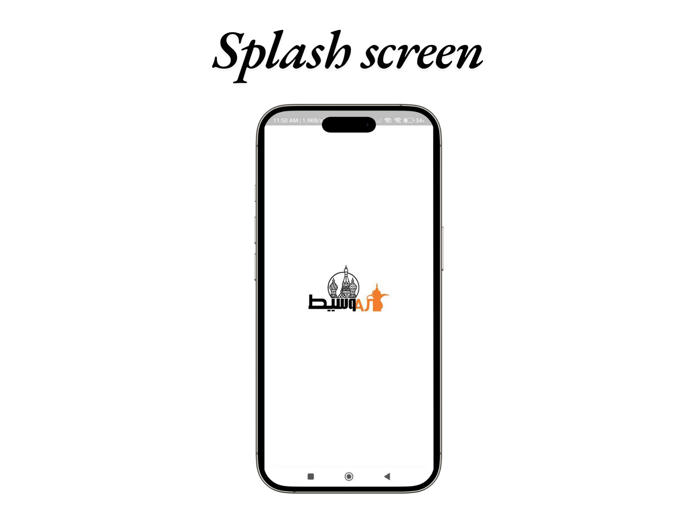
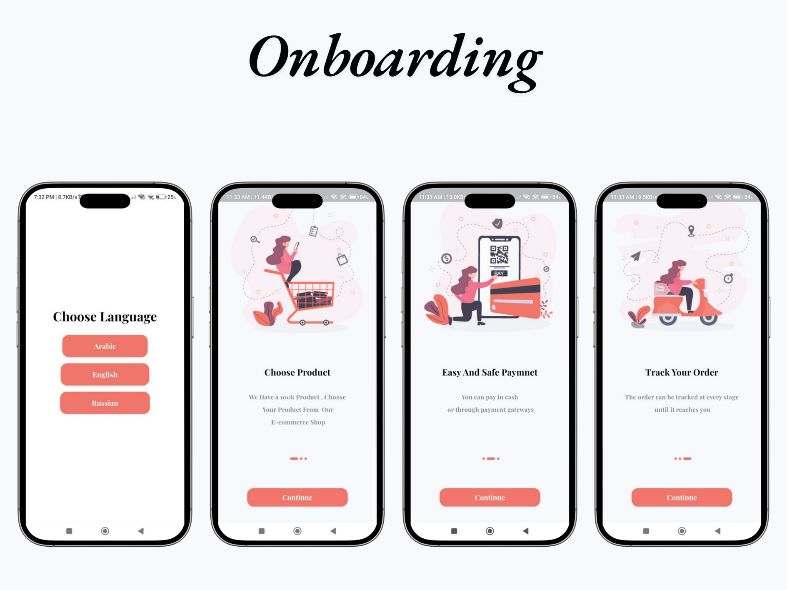
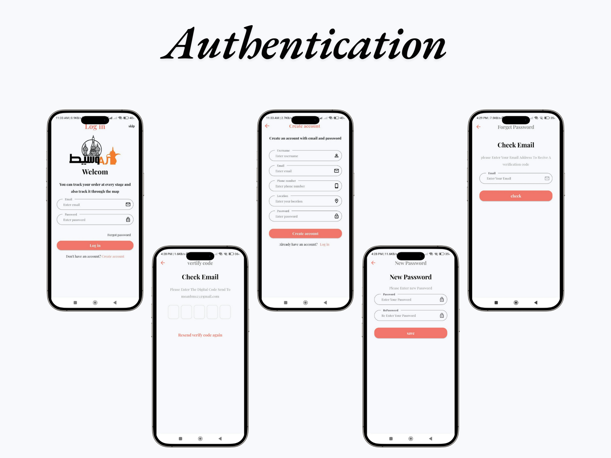
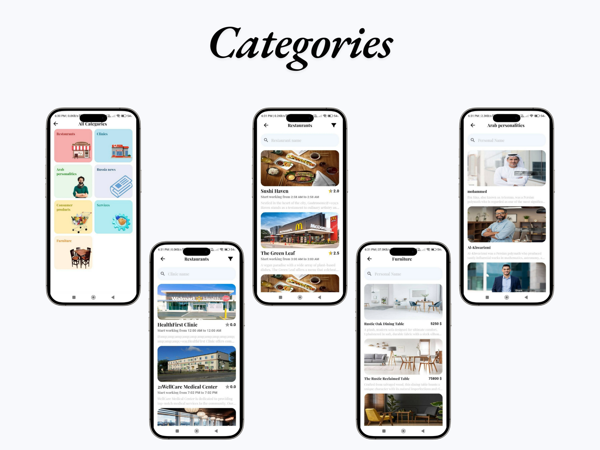
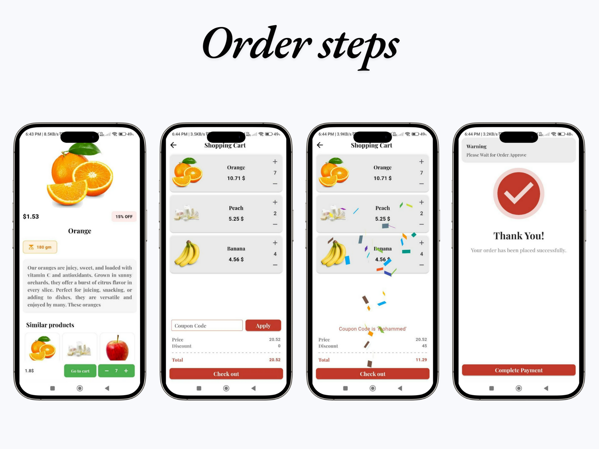
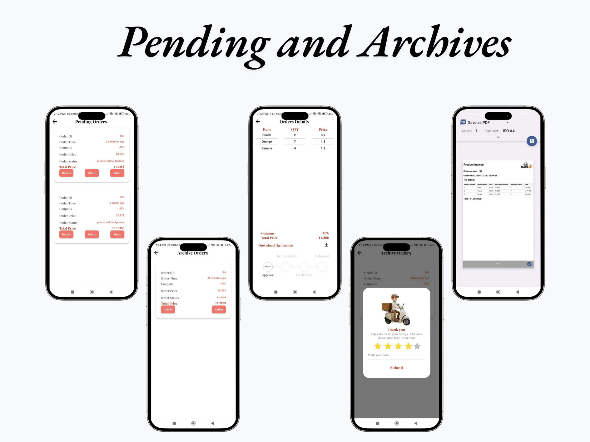
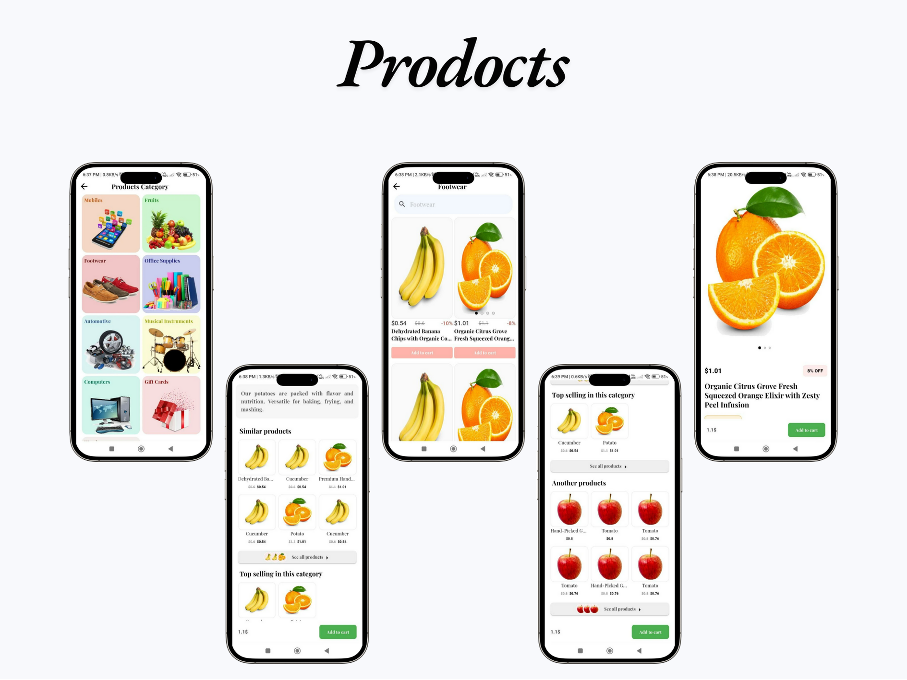
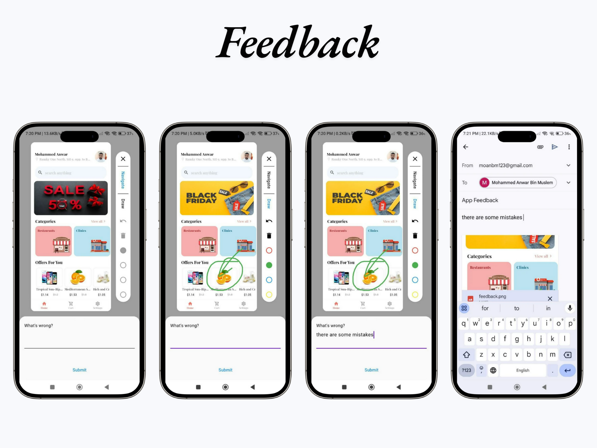
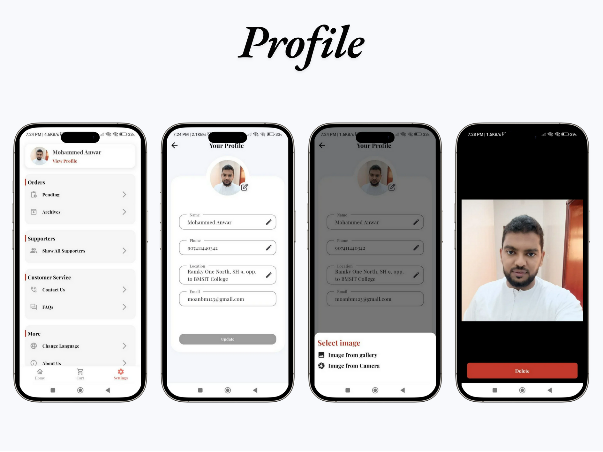
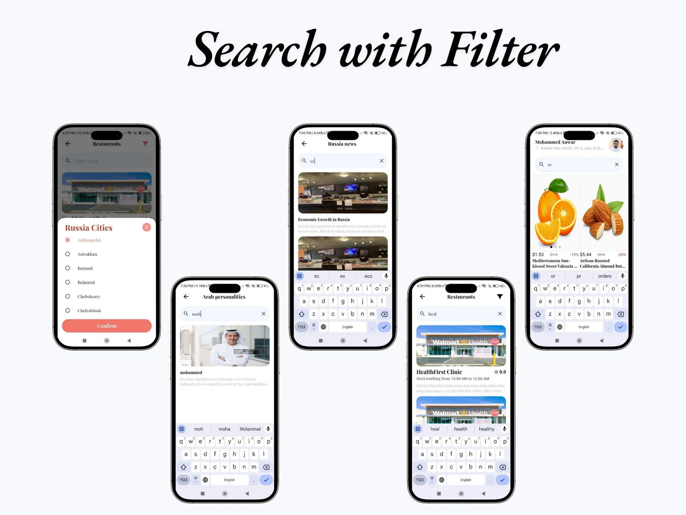

# **Alwaseet App** 🌟📱 *Freelancer*

Welcome to **Alwaseet**! 🎉🔎 This multi-category platform is your gateway to exploring a world of diverse services and products, covering everything from restaurants and clinics to Arab personalities, Russian news, consumer products, and more. With its sleek design, user-friendly interface, and comprehensive features, **Alwaseet** ensures a seamless and personalized experience for every user. ✨🚀

---

## **🌟 Features 🌟**

### 1. **Splash Screen** 🌟  
 

Enjoy a warm and smooth welcome every time you open **Alwaseet** with our elegant splash screen. 🚀✨  

---

### 2. **Onboarding 🎉📲**  
  

Start your journey with an engaging onboarding experience! 🎈📝  

- **Welcome Screen:** A warm introduction to **Alwaseet** and its benefits. 🏠🎉  
- **Feature Highlights:** Discover key features for an optimized experience. 📋🌟  
- **Interactive Navigation:** Get acquainted with our intuitive interface. 🕹️📱  

---

### 3. **Authentication 🔒**  
  

Stay secure with our comprehensive authentication system! 🛡️  

- **Sign Up and Login:** Easily create an account or log in securely. 🔑👤  
- **Password Recovery:** Forgot your password? Reset it quickly with our recovery options. 🔄🔐 
- **Biometric Login:** Use your fingerprint or face recognition for a faster, secure login experience. 🖐️📱  

---

### 4. **Categories 📂**  
  

Discover six diverse categories designed to meet all your needs, including restaurants, clinics, Arab personalities, Russian news, consumer products, and services. 🎡🍔

- **Restaurant Listings:** Browse and order from your favorite local eateries. 🍽️☕️
- **Clinics:** Find trusted healthcare providers and book appointments. ⚕️🏥
- **Arab Personalities:** Dive into detailed profiles and insights. ⭐️
- **Russian News:** Stay updated with curated news stories. 🇷🇺
- **Consumer Products:** Shop a wide range of items with detailed descriptions. 🛒✔️
- **Services:** Access various services tailored to your needs. 🔧✅

---

### 5. **Order Management 🛒📦**  
  

ease from placement to delivery. 🚚✔️

Select Products: Browse through categories and choose the products you want to order. 🛍️
Confirm Order: Review the details (like quantity, price, address) and make sure everything is correct before proceeding. ✔️
Choose Payment Method: Select your preferred payment method, whether it's through card payment or cash on delivery. 💳
Final Confirmation: After reviewing all the details, confirm your order for it to be sent to the restaurant or store. ✅
Track Order: Once the order is confirmed, you can track its status from "Processing" to "On the Way" and finally "Delivered." 🔎🚚
Receive Order: Upon arrival, make sure to receive your order and enjoy the products or services you ordered. 🎉

---

### 6. **Pending and Archives 📂🕰️**  
  

Keep track of all your orders effortlessly! 📂🕰️  

- **Pending Orders:** View and manage orders awaiting processing. ⏳📦  
- **Archives:** Access completed orders and keep your history organized. 📜🔒  
- **Invoices:** Download the invoices . 📝

---

### 7. **Products 🛍️📋**  
  

Browse and manage products seamlessly! 🛍️📋  

- **Product Listings:** Explore a wide range of items in a visually appealing layout. 📋🖼️  
- **Details View:** Tap on any product for a detailed description and price. 🔍💲  
- **Add to Cart:** Quickly add products to your cart for checkout. 🛒💳  

---
### 8. **Feedback 🗣️💬**  
  

Share your thoughts and help improve the platform. **Alwaseet** values your feedback! 💌❤️

- **Rate Services:** Provide ratings for restaurants, clinics, and more. ⭐️
- **Write Reviews:** Share detailed feedback to guide other users. 🖋
- **Admin Response:** Receive timely replies to your queries and suggestions. 🙌🌐

---
### 9. **Profile 👤⚙️**  
  

Manage your account details and settings easily! 👤⚙️  

- **User Information:** Update your name, location, and profile picture. 📋🖼️  
- **Security:** Change your password or enable biometric authentication. 🔒🛡️  

---

### 10. **Search with Filters 🔍⚙️**  
  

Find exactly what you’re looking for with advanced search features! 🔍⚙️  
- **Quick Search:** Type keywords, product IDs, or categories. ⌨️
- **Filters:** Refine results by city. 🔎📊
---

## **📬 Contact Us 📬**  

Have questions or need assistance? We’re here to help! 🤗💬  

- **Email:** moanbm123@gmail.com 📧  
- **LinkedIn:** [@Mohammed Anwar](https://www.linkedin.com/in/mohammad-anwar-bin-muslim-50102725b/) 🐦 
- **WhatsApp:** [Contact us on WhatsApp](https://wa.me/+917411440342) 📱  

---

### **🌟 Thank you for visiting Alwaseet! 🌟**  

We look forward to hearing your thoughts and suggestions to keep improving **Alwaseet** for a better scheduling and management experience! ✨💬
